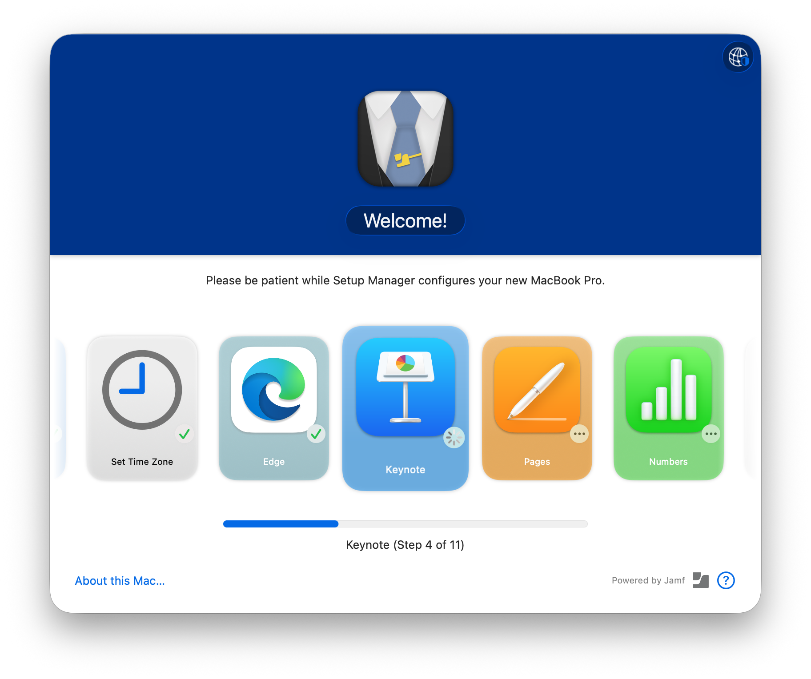

# Setup Manager

_"Every Assistant has a Manager"_

 
Updates are published in the '[Releases](https://github.com/jamf-concepts/setup-manager/releases)' section of the repo. There you can also [download the latest pkg installer](https://github.com/jamf-concepts/setup-manager/releases/latest). You can subscribe to notifications for the repo using the 'Watch' button above.

Please report issues, feature requests [as an issue.](https://github.com/jamf-concepts/setup-manager/issues)

We have opened the [discussions](https://github.com/jamf-concepts/setup-manager/discussions) area for questions and more generic feedback.

There is also a [`#jamf-setup-manager`](https://macadmins.slack.com/archives/C078DDLKRDW) channel on the [MacAdmins Slack](https://macadmins.org).

## What it does

There are many enrollment progress tools available for Mac admins, each with their own strengths. Jamf Setup Manager approaches the problem from the perspective of an IT service provider.

Setup Manager offers many of the same features of these utilities but is especially useful for the case where an IT department or provisioning depot wants to ensure that a new Mac is properly configured and assigned before sending the device to its new user. It runs over Setup Assistant before a user is created, so it won't interfere with MDM-capable user or the secure token flow for FileVault. You can control which policies and installations Setup Manager runs with a configuration profile.

Setup Manager provides:

- a nice modern UI
- configuration with a configuration profile, no need to modify shell scripts or json
- works with different deployment workflows
  - zero-touch (user-driven)
  - single-touch (tech-driven)
  - user initiated enrollment
  - handsfree deployment with Auto Advance
- customized branding
- localized interface and localizable custom text
- works with Jamf Pro and Jamf School

## Installation and Configuration

- Jamf Pro
  - [JamfPro-Quick Start](Docs/JamfPro-QuickStart.md)
  - zero-touch and user-initiated deployments (forthcoming)
  - [extra installations based on user data entry](Docs/JamfPro-TwoPhase.md)
  - [Single-touch workflow with user re-assignment using Jamf Connect](Docs/JamfProConnect-SingleTouch.md)
  - [handsfree deployment with AutoAdvance and Setup Manager at login window](Docs/JamfPro-LoginWindow.md)
- [Jamf School](Docs/JamfSchool-Setup.md)
- [Extras and Notes](Docs/Extras.md)
- [Frequently Asked Questions](Docs/FAQ.md)
- [Webhooks](Docs/Webhooks.md)
- [Network Connectivity Checks](Docs/Network.md)

## Configuration Profile

The structure of the configuration profile [is documented here](ConfigurationProfile.md).

There is also a [custom schema for Jamf Pro](Docs/Extras.md#custom-json-schema-for-jamf-pro).

## Requirements

Setup Manager requires macOS 13.5 or higher. It will work only with Jamf Pro or Jamf School.

## Known Issues

- Setup Manager will **_not_** launch at enrollment with Auto-Advance enabled, use the option to run at login window
- Setup Manager may **_not_** launch or launch and quit quickly when you disable _all_ Setup Assistant screens and skip user creation, leave at least one Setup Assistant option that shows _before_ the user creation enabled, or use the option to run at login window
- Policies that are triggered by `enrollmentComplete` may delay or even disrupt Setup Manager running from Prestage/Automated Device Enrollment. Disable or un-scope policies triggered by `enrollmentComplete` on devices using Setup Manager.

---

Please report issues, feature requests, and feedback (positive and negative) [as an issue.](https://github.com/Jamf-Concepts/Setup-Manager/issues)
